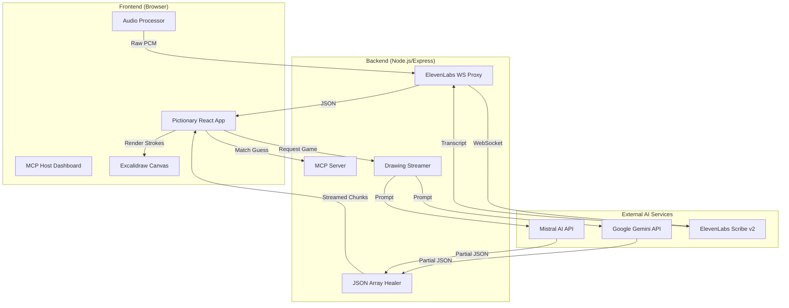

# 🎨 AI Pictionary MCP: Real-time Generative Sketching & Guessing

A high-performance, real-time Pictionary game powered by **Generative AI** and the **Model Context Protocol (MCP)**. Watch an AI artist (Gemini or Mistral) sketch stroke-by-stroke in real-time, and use your voice or keyboard to guess the word before time runs out!

---

## 🚀 Features

-   **Real-time AI Sketching:** Watch the AI draw live using Excalidraw elements. The drawing is streamed chunk-by-chunk using a custom JSON "healing" parser for zero-latency progressive rendering.
-   **Dual-Model Support:** Choose between **Gemini 2.0 Flash** (creative/detailed) or **Mistral Large** (fast/schematic) for different drawing styles.
-   **Voice Guessing (STT):** Integrated with **ElevenLabs Scribe v2** via a secure WebSocket proxy for ultra-low latency speech-to-text. Just speak your guess!
-   **MCP Native:** Built on the Model Context Protocol, allowing the game to be hosted, shared, and discovered as a standardized MCP service.
-   **Unified Deployment:** A single-port architecture combining the MCP Host, the Game UI, and the Backend Server into one cohesive production artifact.

---

## 🏗️ Architecture

The project follows a **Single-Service Hub** architecture to ensure low-latency communication between the AI models and the frontend.



---

## 🔄 Workflow

1.  **Game Start:** The user clicks "New Game". The backend picks a random word (e.g., "Eiffel Tower").
2.  **AI Prompting:** The server crafts a specialized "SVG-to-Excalidraw" prompt for the selected model.
3.  **Streaming:** As the LLM generates the JSON array of drawing elements, the backend captures the stream.
4.  **Healing & Rendering:** Since JSON chunks are often invalid partial strings, the `healJsonArray` utility fixes broken brackets and quotes in real-time, feeding valid elements to the `Excalidraw` canvas every few milliseconds.
5.  **Guessing:** The user speaks or types.
    -   *Audio:* PCM data is streamed to the ElevenLabs proxy. Matching words trigger an automatic guess submission.
    -   *Text:* Standard keyboard input.
6.  **Validation:** The MCP `check_guess` tool validates the guess and updates the shared game state.

---

## 🛠️ Tech Stack

-   **Frontend:** React, TypeScript, Vite, Excalidraw SDK.
-   **Backend:** Node.js, Express, `ws` (WebSockets).
-   **Communication:** Model Context Protocol (MCP) for tool/resource discovery.
-   **AI Models:**
    -   **Gemini 2.0 Flash:** Primary drawing engine.
    -   **Mistral Large 2:** Secondary drawing engine.
    -   **ElevenLabs Scribe v2:** Real-time STT.
-   **Deployment:** Dokploy / Nixpacks (Dockerized).

---

## 🚦 Getting Started

### Prerequisites
-   Node.js v20+
-   API Keys for:
    -   Google Gemini (`GOOGLE_GENERIC_AI_API_KEY`)
    -   Mistral AI (`MISTRAL_API_KEY`)
    -   ElevenLabs (`ELEVENLABS_API_KEY`)

### Installation

1.  Clone the repository:
    ```bash
    git clone https://github.com/arkarn/pictionary.git
    cd pictionary
    ```

2.  Install dependencies:
    ```bash
    npm install
    ```

3.  Configure environment:
    Create a `.env` file in the root:
    ```env
    PORT=3001
    GOOGLE_GENERIC_AI_API_KEY=your_key
    MISTRAL_API_KEY=your_key
    ELEVENLABS_API_KEY=your_key
    ```

4.  Run in development:
    ```bash
    npm run dev
    ```

5.  Build for production:
    ```bash
    npm run build
    npm run serve
    ```

---

## 🏆 Hackathon Credits

Built with ❤️ for the MCP Hackathon. Pushing the boundaries of real-time generative UI and standardized AI communication.
