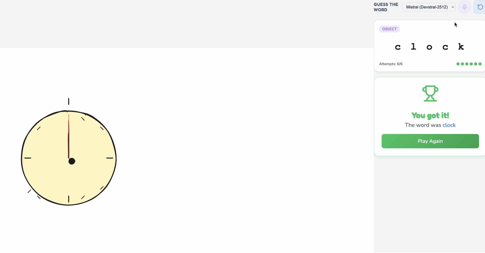
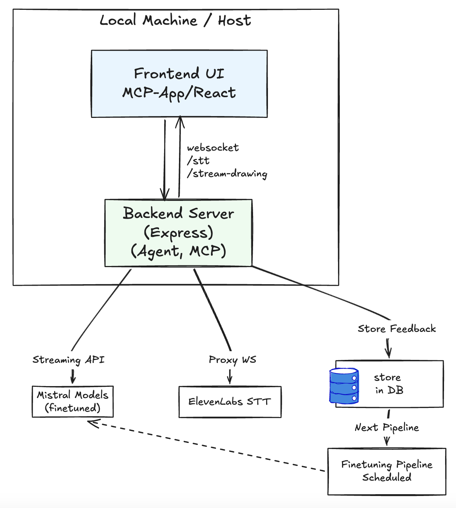
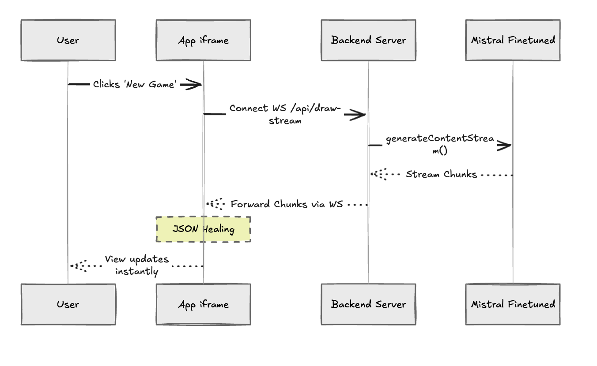
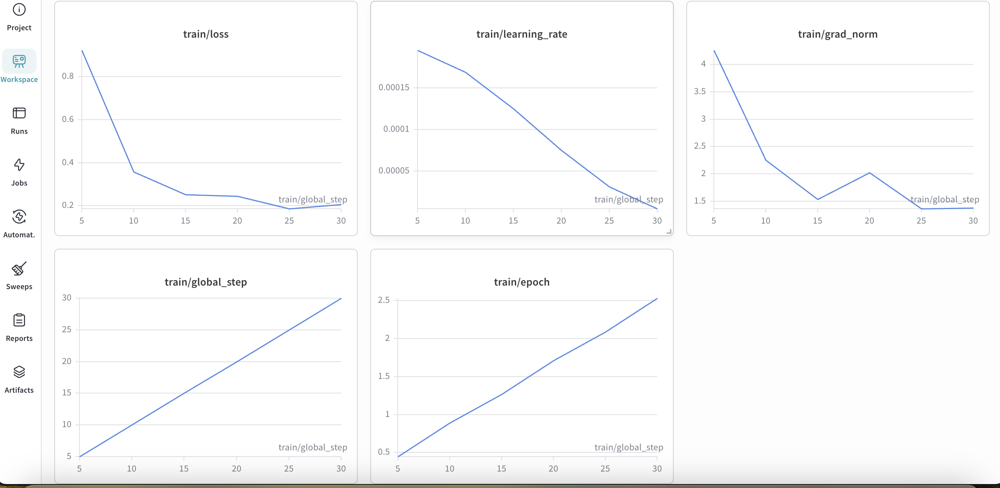

# Pictionary MCP App



A real-time, AI-powered Pictionary game where an AI agent draws based on your requests, and you guess using voice or text. Built using the Model Context Protocol (MCP), Excalidraw, and finetuned LLMs.

## 🚀 Key Features

- **AI-Driven Drawing**: Uses a finetuned Ministral 8B model to generate high-quality freehand and object strokes.
- **Dynamic Rendering**: Leveraging the Excalidraw MCP to stream and render drawings in real-time.
- **Real-time Voice Guessing**: Integrated ElevenLabs Speech-to-Text (STT) for seamless voice interaction.
- **Feedback-Driven Optimization**: Thumbs up/down system to collect user feedback for continuous model improvement.
- **Streaming Architecture**: True streaming of JSON elements for instant visual feedback.
- **Scalable Design**: Easily generalized for multiplayer chatroom environments.

## 🛠️ Technology Stack

- **Frontend**: React, Excalidraw SDK, Vite
- **Backend**: Node.js, Express, WebSocket (WS)
- **AI/LLM**: Ministral 8B (Finetuned), Gemini 1.5 Pro (Data Generation)
- **STT**: ElevenLabs Real-time STT
- **Protocol**: Model Context Protocol (MCP)

## 🏗️ Architecture

### High-Level Overview

The system follows a modern client-server architecture with a heavy focus on streaming and real-time interaction.



### Streaming Flow

Drawing elements are generated as a stream of JSON chunks, which are "healed" on the frontend to provide an instant drawing experience.



## 📈 Finetuning Pipeline

We use a scheduled pipeline to improve drawing quality and reduce latency:

1.  **Data Generation**: High-quality JSON drawing data is generated using larger models like Gemini or Claude.
2.  **User Feedback**: Real-world performance is tracked via user ratings.
3.  **Finetuning**: Ministral 8B is finetuned on the combined dataset to optimize for JSON output consistency and artistic quality.



- **Finetuning Notebook**: [Google Colab](https://colab.research.google.com/drive/1LMFJDHu9ZS9_uyKLn097_n8Gw0ASmL_c?usp=sharing)
- **Model Registry**: [Hugging Face](https://huggingface.co/siddss/pictionary-ministral-8b-merged)

## 🏁 Getting Started

1.  **Clone the repository**:
    ```bash
    git clone https://github.com/yourusername/pictionary-mcp-app.git
    ```
2.  **Install dependencies**:
    ```bash
    npm install
    ```
3.  **Set up environment variables**:
    Create a `.env` file with your API keys (Gemini, Mistral, ElevenLabs).
4.  **Run in development mode**:
    ```bash
    npm run dev
    ```