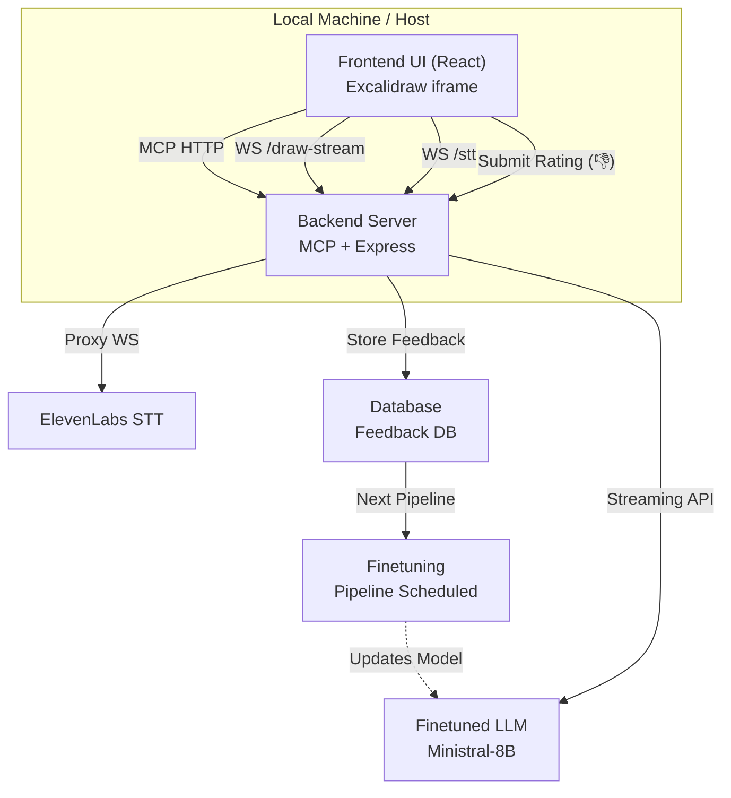
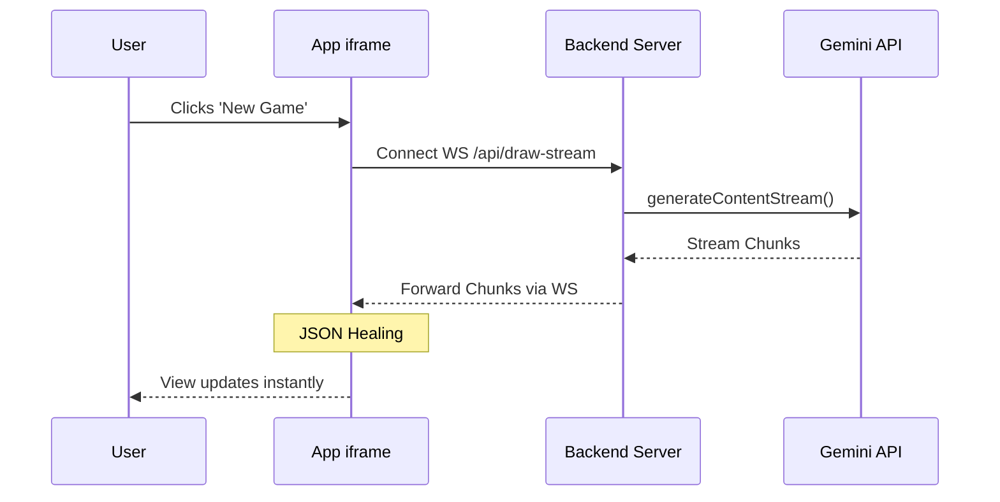

# Pictionary MCP App Diagrams

This folder contains the architecture diagrams and flow charts for the Pictionary MCP App.

## Mermaid Diagrams

### Architecture

### True Streaming Architecture Flow

## Excalidraw Files
- `architecture.excalidraw`: High-level architecture showing the interaction between the Host, Frontend iframe, Backend Server, Finetuned LLM, ElevenLabs STT, and the new Feedback/Finetuning DB pipeline.
- `flow-chart.excalidraw`: Sequence flow demonstrating the "True Streaming Architecture" via WebSocket sidechannel.

You can open the above files using the Excalidraw VSCode extension, or simply import them at [excalidraw.com](https://excalidraw.com).

### Shareable Links (Web View)
If you just want to view the images online without downloading or importing:
- **Architecture Diagram**: [View on Excalidraw](https://excalidraw.com/#json=EFhETJ7d8dCjXI7D66A9d,PokBcGDWLUQOLAYyyU4d2A)
- **Streaming Flow Chart**: [View on Excalidraw](https://excalidraw.com/#json=UgDvRMad15CaxbIJZKKS7,oAkeHWMwKiLcDs-L5l_I-A)
